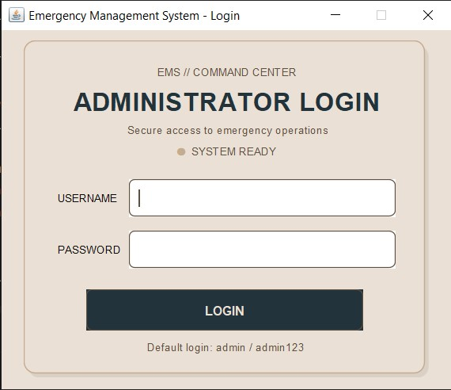
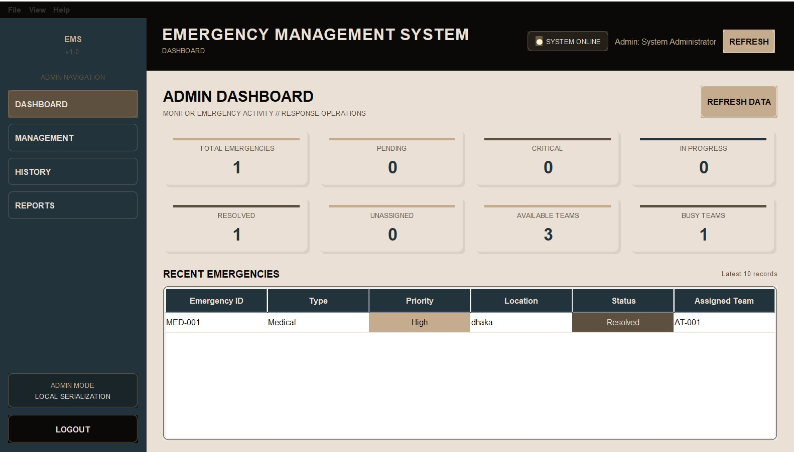
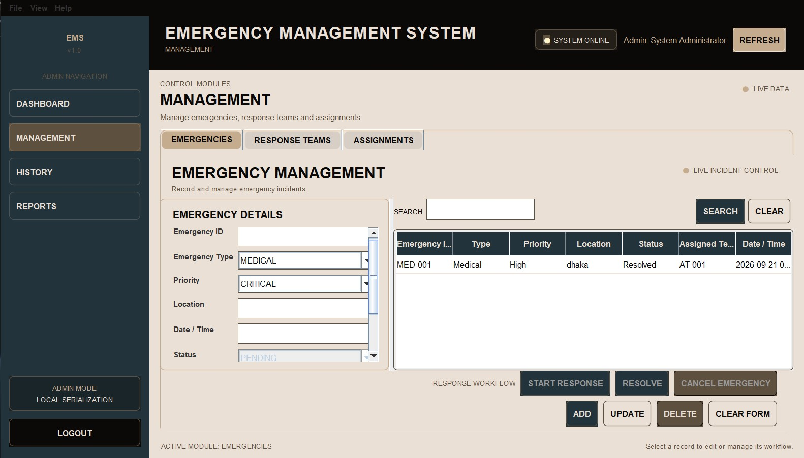
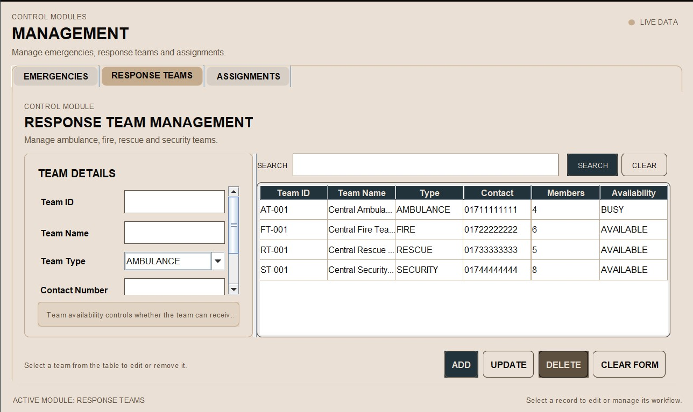
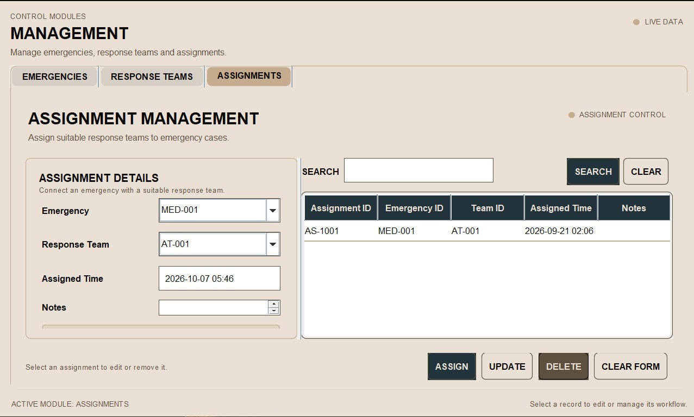
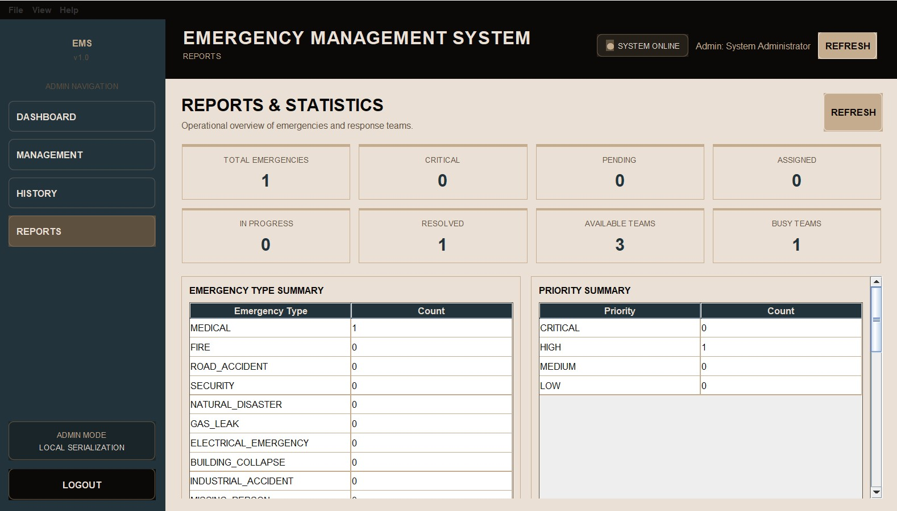
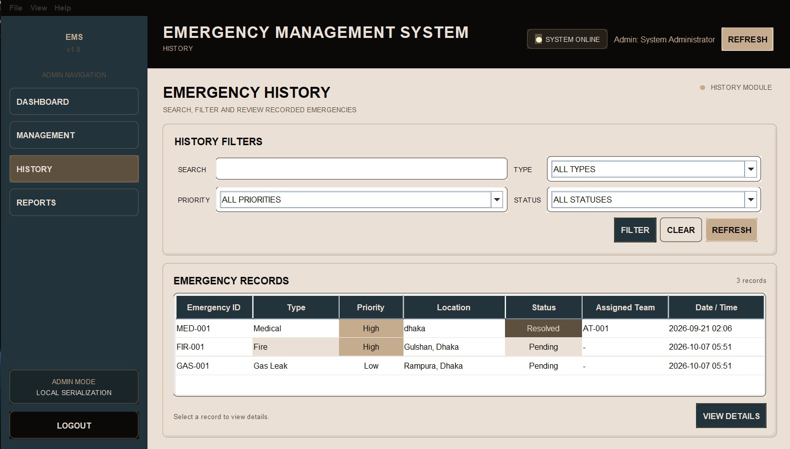

# Emergency Management System

A Java Swing desktop application for managing emergency incidents, response teams, assignments, operational history, and administrative reports.

This project was developed independently as a university course project to apply object-oriented programming, desktop GUI development, business-logic design, validation, and local data persistence in a complete software application.

## Overview

The Emergency Management System provides an administrative interface for recording emergency incidents, coordinating response teams, managing assignments, and reviewing operational information.

The application allows an administrator to:

- Create and manage emergency incidents
- Manage different types of response teams
- Assign response teams to emergencies
- Track emergency status and assignment history
- Search and filter records
- Monitor team availability
- View dashboard statistics and reports
- Persist application data locally between sessions

The current version is a local desktop application built with Java Swing.
## Screenshots

### Login

<p align="center">
  
</p>

### Dashboard

<p align="center">
  
</p>

### Emergency Management

<p align="center">
  
</p>

### Response Team Management

<p align="center">
  
</p>

### Assignment Management

<p align="center">
  
</p>

### Reports

<p align="center">
  
</p>

### Emergency History

<p align="center">
  
</p>


## Features

### Emergency Management

- Create, update, search, and delete emergency records
- Automatic emergency ID generation
- Emergency type and priority classification
- Input validation
- Controlled emergency status transitions
- Emergency history and filtering
- Detailed emergency information

### Response Team Management

- Create, update, search, and delete response teams
- Multiple response-team types
- Team availability tracking
- Team suitability checking
- Automatic availability updates during assignment workflows

### Assignment Management

- Assign response teams to emergencies
- Track assignment details and timestamps
- Maintain relationships between emergencies and teams
- Validate assignment operations
- Keep emergency and team states synchronized

### Critical Emergency Handling

Critical emergencies can trigger automatic response-team selection based on emergency requirements and currently available suitable teams.

This connects the emergency, response-team, and assignment workflows into a single business process.

### Dashboard and Reports

- Emergency statistics
- Response-team statistics
- Assignment information
- Historical records
- Search and filtering
- Operational reports

### Authentication

The application provides an administrator login before access to the main management interface.

### Local Persistence

Application data is stored locally using Java object serialization. Runtime data files are generated automatically when the application saves data.

## Application Architecture

The project separates user-interface code, business logic, domain models, and persistence responsibilities.

```text
                    ┌──────────────────────────┐
                    │       Java Swing UI      │
                    │ Login / Dashboard /      │
                    │ Management / Reports     │
                    └────────────┬─────────────┘
                                 │
                                 ▼
                    ┌──────────────────────────┐
                    │      Manager Layer       │
                    │ Business Logic /         │
                    │ Validation / Rules        │
                    └────────────┬─────────────┘
                                 │
                                 ▼
                    ┌──────────────────────────┐
                    │       Model Layer        │
                    │ Emergency / Team /       │
                    │ Assignment / Admin       │
                    └────────────┬─────────────┘
                                 │
                                 ▼
                    ┌──────────────────────────┐
                    │    Persistence Layer     │
                    │   Java Serialization     │
                    └──────────────────────────┘
```

### Package Structure

```text
src/
├── app/
├── enums/
├── manager/
├── model/
├── persistence/
└── ui/
```

### Package Responsibilities

**`app/`**  
Contains the application entry point and startup logic.

**`enums/`**  
Contains shared enumerations such as emergency types, priorities, statuses, and response-team types.

**`manager/`**  
Contains business logic, validation, CRUD operations, searching, filtering, statistics, status management, team suitability, and assignment rules.

**`model/`**  
Contains the domain objects representing administrators, emergencies, response teams, and assignments.

**`persistence/`**  
Handles local data storage and retrieval using Java object serialization.

**`ui/`**  
Contains Java Swing frames, panels, dialogs, forms, tables, navigation, and user interaction.

## Object-Oriented Design

The project applies core object-oriented programming principles throughout the application.

### Abstraction

`ResponseTeam` is implemented as an abstract class that defines common response-team properties and behavior.

### Inheritance

Specialized response-team classes extend the common `ResponseTeam` abstraction.

```text
ResponseTeam
├── AmbulanceTeam
├── FireTeam
├── RescueTeam
└── SecurityTeam
```

### Encapsulation

Model state is encapsulated through private fields and controlled access using constructors, getters, and setters.

### Polymorphism

Different response-team implementations share the `ResponseTeam` abstraction and override `respondToEmergency()` with specialized behavior.

This allows different concrete team types to be handled through the common `ResponseTeam` type.

## Emergency Lifecycle

Emergency records follow a controlled lifecycle:

```text
PENDING
   │
   ▼
ASSIGNED
   │
   ▼
IN_PROGRESS
   │
   ▼
RESOLVED
```

The application also supports cancellation from appropriate active states.

Status transitions are validated in the manager layer rather than being controlled only by the graphical interface.

## Core Workflow

A typical emergency-management workflow is:

```text
Create Emergency
       │
       ▼
Set Type & Priority
       │
       ▼
Find Suitable Team
       │
       ▼
Create Assignment
       │
       ▼
Update Team Availability
       │
       ▼
Track Emergency Status
       │
       ▼
Resolve / Cancel
       │
       ▼
Persist Updated State
```

For critical emergencies, the system can automatically search for a suitable available team and create the corresponding assignment.

## Technology Stack

| Technology | Purpose |
|---|---|
| Java 26 | Core application development |
| Java Swing | Desktop graphical user interface |
| Java Serialization | Local data persistence |
| Object-Oriented Programming | Domain and application design |
| IntelliJ IDEA | Development environment |

## Getting Started

### Requirements

- JDK 26
- A Java-compatible IDE such as IntelliJ IDEA

### Run the Application

1. Clone the repository:

```bash
git clone https://github.com/kaal001/emergency-response-management-system.git
cd emergency-response-management-system
```

2. Open the project in your Java IDE.

3. Locate:

```text
src/app/Main.java
```

4. Run `Main.java`.

5. The administrator login screen will appear.

The application creates the runtime data directory automatically when persistent data is saved.

## Download

A packaged version of the application is available through GitHub Releases.

**Download and run the latest release:**

[**Download Latest Release →**](../../releases/latest)

The release provides a ready-to-use packaged version of the application, so users can run the software without manually building the project from source.

For developers who want to inspect or modify the implementation, the complete source code is available in this repository.

## Data Persistence

The application uses Java object serialization for local persistence.

Runtime files are stored inside:

```text
data/
```

These generated files are excluded from version control.

A fresh clone therefore starts with a clean local data state, and the application creates its own runtime data as needed.

## Project Structure

```text
Emergency-Management-System/
│
├── src/
│   ├── app/
│   ├── enums/
│   ├── manager/
│   ├── model/
│   ├── persistence/
│   └── ui/
│
├── .gitignore
└── README.md
```

## Engineering Highlights

This project provided practical experience in designing and integrating multiple parts of a desktop software system.

Key areas include:

- Separation of UI and business logic
- Object-oriented domain modeling
- Inheritance and polymorphism
- Emergency state management
- Team suitability and availability logic
- Automatic assignment workflows
- CRUD operations
- Input validation
- Search and filtering
- Local data persistence
- Dashboard statistics and reporting
- Coordinating state changes across related objects

## Future Improvements

Potential extensions for a larger version of the system include:

- Database-backed persistence
- Password hashing and stronger authentication
- Role-based access control
- Automated unit and integration testing
- More advanced analytics and reporting
- Improved application packaging and distribution
- Multi-user or network-based operation

## AI Assistance

AI tools were used during the development of this project as a supporting resource for problem-solving, debugging, code organization, commenting and documentation.

The project was implemented, integrated, tested, and finalized by the author, with AI assistance used as a development aid.

## Project Status

**Completed**

A solo university course project developed as a practical Java desktop application.

The current version focuses on the administrative workflow, emergency lifecycle management, response-team coordination, assignment handling, reporting, and local persistence.

## Author

**Takbir Rahman**

Computer Science & Engineering Student

GitHub: [@kaal001](https://github.com/kaal001)
